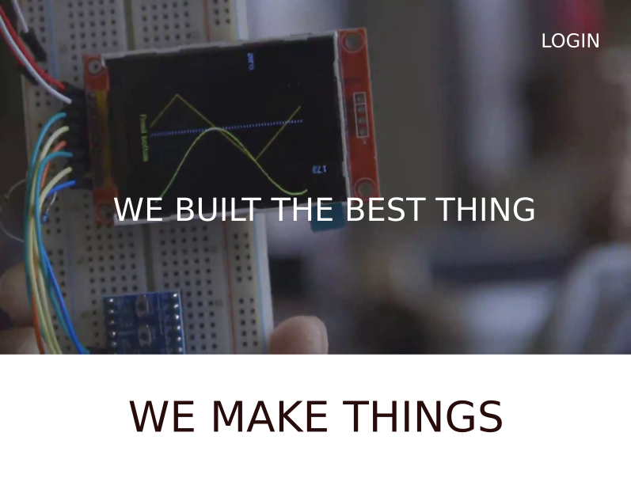
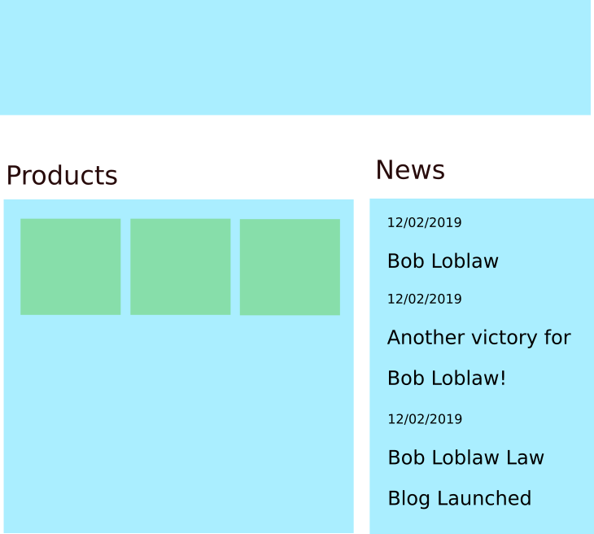

# Web Design Task 3

## Installation

Run `npm install`

## Usage

To run the live server, run `npm run serve`

## Task

Recreate the following designs in HTML / CSS

### Header

1. The header should take up 100% of the vertical height

2. The "hero image" should take up 80% of the vertical height, with the text below taking up the remaining 20% of the vertical height

### Main

